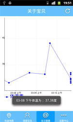

# Medium_06_AnXiangBan
2014年全国服务外包创新创业大赛二等奖作品

# 关于
## “安相伴”智能随身卫士

宁波大红鹰学院   Growth团队

陈静、林凡皓、许伟沣、张振宇、左雪峰

指导教师：李晓蕾

随着我国市场经济的进一步发展和社会结构的急剧转型，社会弱势群体及其问题日益凸显。现阶段中国弱势群体的构成状况复杂、存在问题多样，弱势群体的规模有不断扩大的趋势，并且已经成为了影响社会稳定与社会发展的重要风险因素之一。本团队开发的“安相伴”智能随身卫士，实现提前预测、实时监护、紧急报警的360度全方位监护，为弱势群体的行动安全、身体健康等各方面带去关怀。

**一、目标问题**

1) 对于弱势群体的走失问题，如何做到快速的定位；

2) 如何获取弱势群体的安全活动区域，并在其超出安全活动范围时，使监护人及时得到警报信息；

3) 如何针对不同的弱势群体提供具有针对性的健康指数监护，保障其健康安全，例如获得儿童当前的体温、老人的心率；

4) 如何保障弱势群体在面临危险时，监护人能及时提醒其远离危险。

**二、解决方案**

根据系统需求，在安卓移动设备平台上进行开发，在手环上采用嵌入式技术，应用传感器、GPS定位系统等技术。并且在服务器端采用MySQL数据库及Socket通信机制，从而实现手环--手机的交互模式。

1) 儿童模式：在手环上采用传感器技术，自动检测儿童的体温，当体温超出正常体温时，发送警报到手机端；

2) 老年人模式：具有语音提醒功能，例如提醒按时吃药。另外，利用多种传感器可对老人健康进行监护；

3) 基本功能：在手环上安装GPS定位系统，并在手机端上设置安全区域，当手环超出手机端设置的区域范围内时，手机端会收到警报信息；

4) 报警功能：采用GPS定位及自动报警机制，在手环佩戴者处于非安全区时，自动反馈信息给手机端。

**三、实现过程**

**1、团队简介：**Growth团队由5人组成，分别是许伟沣、张振宇、林凡皓、陈静、左雪峰。许伟沣、张振宇、林凡皓为技术人员，主要负责代码编写，左雪峰主要负责手环硬件技术的实现，陈静负责文档的撰写。

**2、具体做法：**

* 实时定位轨迹跟踪：通过GPS定位技术，手机客户端可以对手环进行实时定位与轨迹跟踪，并在手机客户端上以地图形式呈现。

* 智能紧急报警：根据佩戴者是否超出安全活动范围、是否靠近危险区域等全方位监控手环佩戴者的安全情况，并当处于非安全区时，手环自动发出准确的警报信息到手机端。

* 监控健康指数：采用多种传感器技术，监测手环佩戴者的体温、心率等身体健康指数，并及时反馈到手机端。

* 贴心语音提醒：通过预设语言提示内容，在手环上按时发出定时事件的提醒，实现贴心服务。如提醒老年人按时服药。

* 远程语音交流：采用media库提供的接口，实现音频的输入输出，利用 Socket通信机制发送语音。

* 技术方面：在Android移动设备平台上进行开发。Android基于Linux内核，采用了软件堆叠架构，叠层主要分成三层：操作系统、中间件、应用程序。在手环上采用嵌入式技术，应用传感器、GPS定位系统等技术。在服务器端采用MySQL数据库及Socket通信机制。

**四、主要特色**

1) 远程监护：在被监护方主要采用手环，而在监护方采用手机，通过与手环轻松关联，对被监护人员的安全与健康进行监护。如下图所示：

2) 安全绑定：手机客户端通过扫描手环包装上的二维码并输入产品包装内的校验码，手环与手机客户端便可轻松关联，同时保证了用户使用的安全性。如下图所示：

3) 智能定位：通过GPS定位技术，手机客户端可以对手环进行实时定位与轨迹跟踪，并在手机客户端上以地图形式呈现。如下图所示：

4) 健康监护：用户可在手机客户端查看手环佩戴者的身体健康数据折线图。根据老人、小孩不同年龄段的身体健康特征，提供了儿童、老人两种不同的功能模式，可分别检测佩戴者的体温和心率。手环的健康指数监控硬件及手机端折线图如下图所示：

5) 多角度模式：针对不同群体的不同需求，研发了不同的功能模式，面向的使用人群广泛。如下图所示：

6) 多方监护：家中多个监护成员可在手机端通过二维码绑定的方式，对同一个手环同时进行监护。
